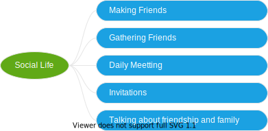

What is 'Social life'? 

I got the explanation from a dictionary that it's the part of a person's life spent doing things with others.

# Course

## [Everyday English: Making friends](https://www.youtube.com/watch?v=5mgxjVsgZB0)

When you meet someone new, the first thing you might want to do is introduce yourself and find out what is your new friend is. But before that, you should greet him or her by saying: 

- 'Hi, how are you?' or 'Hello, how are you doing?'
- 'My name is Jack. What's your name?'

When you say 'How are you doing', you're really asking a question. It's really just a polite greeting.

To respond, you can say: 

- Hi, my name is Sarah. Nice to meet you.
- Nice to meet you. I'm sarah.

If you've already started talking to someone and you don't their name yet, then the polite thing to say is:

- I'm sorry. I did't catch your name.
- I'm sorry. What did you say your name was?

If you're with someone else like your friend or your partner, you should introduce him or her. You could say:

- This my friend Sarah.
- Please meet my friend Sarah.

Now that you've made your introduction, you might want to ask some questions about other person.

If you're coming to Australia to work or study, you probably meet people from all over the world. So you might want to ask:

- Where are you from?
- What's your nationality?

Let's have a look at how to describe your nationality in English.

To describe your nationality, you have to now how to take your country of origin, that's noun, and turn it into adjective. 

So for example:

- I'm from Australia.
- I'm Australian.

There are some patterns for forming adjectives to describe nationality.

First we have the '-an' group. Austrian is an example of that. Australia becomes Australian. India becomes Indian.

- Australia -> Australian
- India -> Indian
- Hungary -> Hungarian
- Italy -> Italian

There's another group of nationalities adjectives that end with '-ese'. For example we say people from:

- China -> Chinese
- Vietnam -> Vietamese

And these's a group nationalities that ends with 'i'. For example:

- Bangladesh -> Bangladeshi
- Pakistan -> Pakistani

But there are also lots of nationalities formed in a irregular way. For example:

- Philippines -> Filipino
- Netherlands -> Dutch

There are even a few countries that can't really be turned into adjectives. For example:

- New Zealand -> New Zealander

Now that's noun, not an adjective and is why you have to add the article 'a'.

You might also want to ask someone about their work by saying:

- What do you do for a living?
- What do you do?

Or if they're students, you could say:

- Are you studying here?
- What are you studying?

Notes that if a question starts with 'are', 'do' or 'does', the answer is likely to be 'yes' or 'no'. For example:

- Do you like ice cream? - Yes, I do.
- Do you go to university? - No, I don't.

You might want to ask your new friend's age by saying:

- How old are you?
- I'm 35.
- I'm 35 years old.

If I didn't want to be too specific, I could say:

- I'm in my 30s.
- I'm in mid-thirties.

Which means my age is somewhere between 30 and 40.

Now you could finish your conversation, you could say:

- It was greating to talk to you.
- It was really nice to meet you.

## [How to Make Friends in English in 30 Minutes](https://www.youtube.com/watch?v=gOSXsGw2v4s)

When you are first getting to know someone:

- What do you do for fun?
- What do you like to do for fun?

This means what are your hobbies? But we generally don't say 'what are your hobbies?' or 'what is your hobby?' It sounds kind of stiff to use that expression.

All relating to 

# Listening

- [I Became Friends with 100 Strangers In a Day](https://www.youtube.com/watch?v=pXTOyBINUW4)

# Reading

- [How to make English friends! Top 10 tips to make new friends](https://studylinks.co.uk/blog/how-to-make-english-friends-top-10-tips-to-make-new-friends)

- []

# Vocabulary

- Sydney
- Marine
- Intruding
- Butcher
- Jesus
- Dude
- Ensemble
- Bagel
- Philly

# Writting
